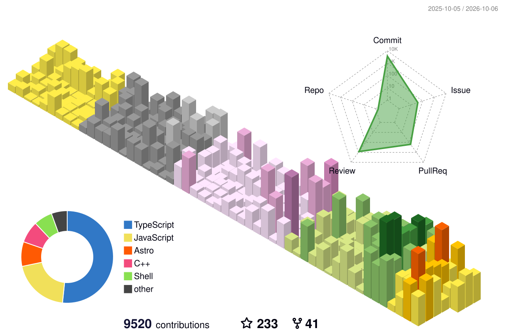

<!-- Header Banner -->

  

<h1 align="center">👋 Hey, I’m <a href="https://portfolio.ibrakdbra.me/">Farouq</a></h1>
<h3 align="center">Software &amp; AI Engineer</h3>

<!-- Typing Tagline -->

  <picture>
    <source media="(prefers-color-scheme: dark)" srcset="https://readme-typing-svg.demolab.com?font=Fira+Code&weight=500&size=18&duration=2800&pause=900&color=79C0FF&center=true&vCenter=true&width=520&lines=Software+Engineer;AI+Engineer;Web+Application+Engineer;Frontend+Developer;Cloud+Architect+%2F+Engineer" />
    
  </picture>

<!-- Social Links -->

  &nbsp;
  &nbsp;
  &nbsp;
  

<!-- Visitor Counter -->

  

<!-- About -->

### 📓 [My Diary & Notes](https://diary.ibra.codes/)

I build scalable backends, AI-powered products and fast web apps, and I still love turning ideas into 3D scenes and games.

🎯 **Mission:** Build impactful, future-ready solutions that inspire and help people. 
🧠 **Focus:** AI engineering, NLP & data science 
🌍 **Based in:** Asia 
🤝 **Open to collaborations:** Innovative projects & creative challenges

> ⚡ *“Life isn’t about finding yourself. Life is about creating yourself.”* ~ George Bernard Shaw

 

## 🛠️ Tech Stack

  

  
  
  
  
  

## 📊 GitHub Activity

  <picture>
    <source media="(prefers-color-scheme: dark)" srcset="profile-3d-contrib/profile-night-rainbow.svg" />
    <source media="(prefers-color-scheme: light)" srcset="profile-3d-contrib/profile-season-animate.svg" />
    
  </picture>

  <picture>
    <source media="(prefers-color-scheme: dark)" srcset="profile-snake/snake-dark.svg" />
    <source media="(prefers-color-scheme: light)" srcset="profile-snake/snake-light.svg" />
    
  </picture>

<!-- Footer Banner -->

  

